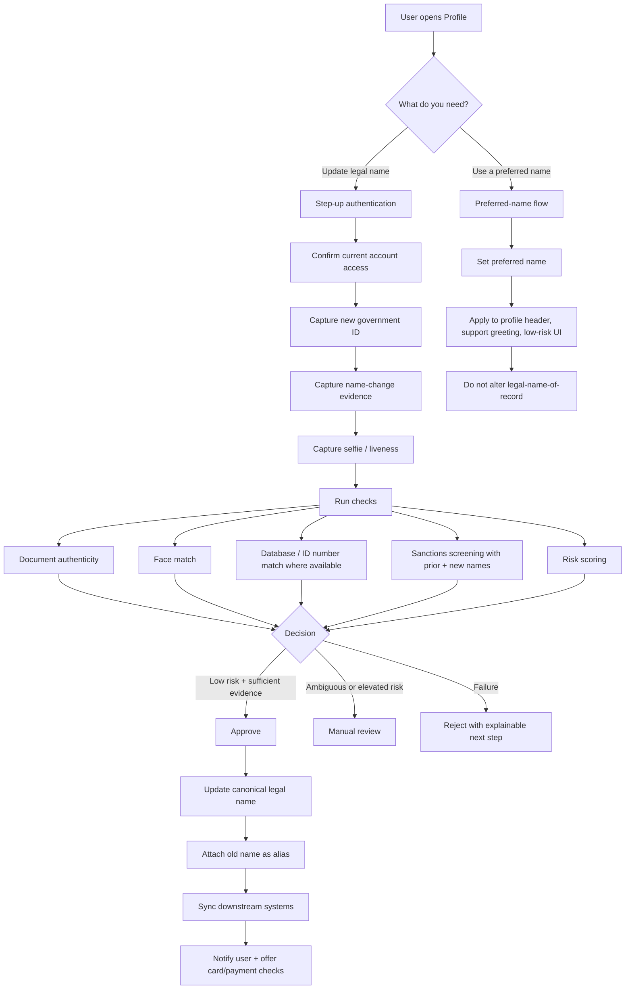
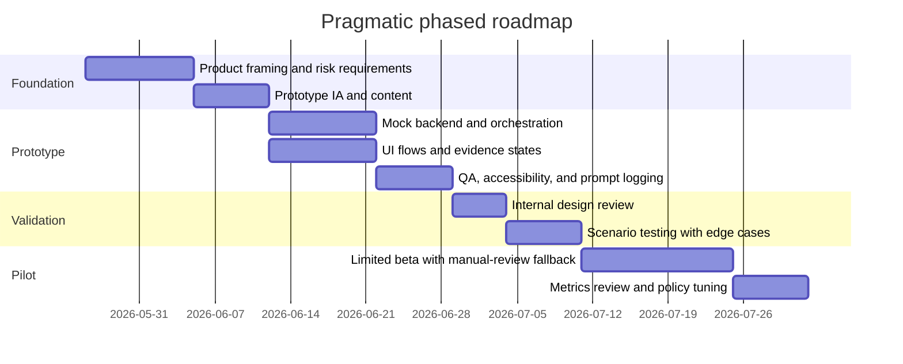

# Remitly Legal Name Change Reverification Design Plan

## Executive summary

A legal-name change in consumer financial services is usually not a simple profile-edit problem. In regulated money movement, a customer’s legal name is tied to identity proofing, anti-money-laundering controls, sanctions screening, payment-instrument matching, and sometimes tax and recordkeeping workflows. Remitly’s U.S. User Agreement says Remitly may require name, address, date of birth, Social Security number, or government ID to create and use an account; that it must verify identity under state and federal law; and that it may make inquiries against third-party databases and require additional information. Remitly also publicly states that card-funded transfers require a “matching name on your Remitly profile.” In other words, if a user’s legal name changes, a silent text edit can break core trust and payments assumptions. citeturn21view0turn31search1turn29search0

The reason different institutions handle name changes differently is not just poor UX. The regulatory baseline is genuinely different across institution types, and the rules are risk-based rather than prescribing one universal operational flow. Banks have explicit Customer Identification Program obligations to obtain and verify name, date of birth, address, and identification number when opening accounts, and they must maintain and update customer information on a risk basis through ongoing due diligence. Broker-dealers have analogous risk-based AML and CDD duties under FINRA. Money services businesses, including money transmitters, must maintain AML programs tailored to their operations and BSA risks, but they are not governed by the exact same bank CIP rule structure. That means a bank branch process, a credit-card secure-message process, and a crypto in-app reverification flow can all be compliant responses to the “same” customer ask. citeturn10search2turn28search2turn14search2turn27search1turn24search0

Tax and sanctions add another layer of difficulty. SSA requires a formal name-record change to issue a replacement Social Security card with the new legal name, and the IRS warns that the name used on returns should match SSA records to avoid delays. The IRS also offers TIN Matching so payers can validate name/TIN combinations, and name/TIN mismatches can trigger CP2100 notices and backup-withholding workflows for certain reportable payments. On the sanctions side, OFAC’s search tools use fuzzy matching, maintain aliases, and even distinguish “weak aliases,” which means institutions often need to preserve prior names and aliases for screening and audit rather than merely overwrite the old name. citeturn25search1turn25search2turn25search12turn25search13turn26search2turn26search3turn26search1turn32search0turn32search3turn32search4turn32search5

The encouraging part is that digitization is feasible. Current identity vendors can verify government IDs, capture selfies, compare biometrics, validate SSN or national-ID data, and route ambiguous cases into manual review. NIST’s current digital identity guidance frames identity proofing as resolving a claimed identity, validating evidence, and verifying that the claimant is the real person presenting that evidence. Stripe Identity supports government-ID, selfie, and ID-number checks; Persona supports government ID, selfie, database verification, configurable match thresholds, and workflow orchestration; Veriff supports document and selfie checks plus database matching and sanctions/PEP add-ons. So the hard problem is no longer “can software read an ID?” The hard problem is “can the system prove that the existing account holder and the newly named person are the same person, then safely propagate that change across downstream systems?” citeturn15search1turn15search3turn15search4turn16search0turn16search1turn16search3turn18search0turn18search7turn18search9turn18search11turn17search3turn17search4turn17search5turn17search6

The best product conclusion for a Remitly-focused prototype is therefore the one you already surfaced: the opportunity is not “make the name field editable.” It is a remote identity re-verification and orchestration system, with a separate preferred-name escape hatch for display-level use cases. That pattern already has real market precedent: Citi lets customers put a preferred first name on eligible cards without changing the legal name on the account, Mastercard’s True Name program exists specifically to support chosen names on cards, and Wise explicitly separates preferred name from legal name used for verification, cards, tax invoices, and payments. citeturn30search1turn30search0turn34view4

## Foundational research basis

### Why legal-name change is hard

The problem space is best understood as a multi-system identity continuity problem.

| Constraint area | Why it matters for a Remitly prototype | Evidence |
|---|---|---|
| Identity proofing and AML | A provider cannot safely let a user overwrite a core identity field if that field anchors onboarding, fraud controls, and regulatory monitoring. Remitly says it must verify identity and may require more information and third-party checks. | Remitly U.S. User Agreement and safety materials. citeturn21view0turn29search0 |
| Institution-type variance | Banks, broker-dealers, and MSBs do not share one identical operational rulebook. Banks have CIP; broker-dealers have FINRA AML/CDD requirements; MSBs must run AML programs tailored to risk. | FFIEC, FINRA, FinCEN. citeturn10search2turn28search2turn14search2turn27search1turn24search0 |
| Funding instrument alignment | Remitly publicly says card-funded transfers require the card name to match the Remitly profile name. A legal-name change therefore touches payments success, not just profile display. | Remitly FAQ. citeturn31search1turn31search5 |
| Tax identity alignment | SSA and IRS processes mean a customer may be “legally renamed” in one system before or after other systems update. Name/SSN mismatches matter operationally. | SSA and IRS. citeturn25search1turn25search2turn25search12turn26search2turn26search3 |
| Sanctions and watchlist screening | Screening engines use fuzzy matching and aliases; prior names may need to remain attached to the customer record. | OFAC SLS and alias guidance. citeturn32search0turn32search3turn32search4 |
| Ongoing monitoring and updates | Regulations are typically event-driven and risk-based. Systems must know when a change should trigger reassessment, not just form submission. | FFIEC and FinCEN CDD guidance. citeturn28search2turn28search1 |
| Human review fallback | Digital proofing is strong, but ambiguous evidence, transliteration issues, or policy exceptions still require workflow/manual review. | NIST, Stripe, Persona, Veriff. citeturn15search3turn15search4turn16search1turn18search9turn17search3 |

### Competitor process comparison

The table below does not prove what Remitly’s internal process is today. It shows the public pattern landscape you are designing against.

| Institution | Segment | Publicly documented name-change pattern | Design takeaway |
|---|---|---|---|
| BECU | Credit union / bank-like | Requires an Update Legal Name form, updated-name photo ID, former-name ID, and a court document or updated SS card; allows online DocuSign, video banking, or in-person; explicitly says there is no option in online banking to edit the name directly. citeturn36view0 | Strong continuity proof between old and new identity; manual orchestration even when intake is digital. |
| Capital One | Bank | Credit-card name changes are phone-assisted; bank-account name changes require updated SSA record, supporting document, and handwritten W-9; submission can be in branch, by secure upload, fax, or mail; some updates are manual. citeturn37view0 | Tax identity and document handling are part of the workflow, not an afterthought. |
| American Express | Card issuer | Users can submit a Name Change Authorization form through the online account and attach updated state ID, driver’s license, or passport; Amex then sends a new card. citeturn35view2 | A relatively streamlined digital-upload model is feasible where downstream systems are controlled. |
| Wise | Fintech / cross-border money | Most personal details are editable, but legal name after transfers is not self-serve; users must contact support and provide the legal name-change document and new ID; Wise separates preferred name from legal name and says legal name is used for verification, cards, tax invoices, and payments. citeturn34view4 | This is the cleanest direct precedent for a “remote reverification + preferred-name escape hatch” architecture. |
| PayPal | Fintech / payments | Users can change a name on the web, but only limited typo edits are simple; legal or major changes may require supporting documentation and photo ID. citeturn7search7 | “Editable in settings” can coexist with substantial verification rules, but only when scoped carefully. |
| Coinbase | Crypto / financial services | Legal-name change is started from Profile > Personal Info > Legal Name, then completed with photo-ID verification; unresolved cases escalate to secure uploads of updated ID plus court, divorce, marriage, or deed poll documents. citeturn34view3 | Best-in-class precedent for “remote reverification first, manual review second.” |
| Citi | Bank / card issuer | Citi supports a preferred first name on many eligible cards via profile or customer service while keeping the legal name on the account and legal communications. citeturn30search1 | Strong evidence that display identity and legal identity should be modeled separately. |
| Mastercard True Name | Network-level precedent | Mastercard’s True Name program exists so cardholders can personalize first names on cards, including through Citi. citeturn30search0turn30search6 | The preferred-name concept is commercially real, not just a UX idea. |

## DESIGN.md

Save the following section as `DESIGN.md`.

## Remitly prototype design plan

### Product framing

**Working thesis**

Remitly should treat legal-name change as a **remote identity re-verification and orchestration journey**, not as a profile text edit. The prototype should additionally offer a **preferred-name escape hatch** for low-risk display contexts, while keeping the legal-name record authoritative for verification, payments, compliance, and any tax-sensitive workflows. This framing matches market precedent from Wise, Citi, and Mastercard True Name. citeturn34view4turn30search1turn30search0

**Problem statement**

A user who legally changed their name may be unable to update Remitly cleanly because the product likely needs to preserve trust, payment eligibility, and compliance continuity across identity records, sanctions screening, and payment instrumentation. The prototype should reduce friction **without** degrading fraud, AML, or audit posture. Remitly’s own public materials show that identity verification, additional document requests, and name matching for card-funded payments are already part of the product’s trust model. citeturn21view0turn31search1turn29search0

**Non-goals**

The prototype should not:
- turn legal-name change into a raw editable settings field,
- attempt to remove compliance review where evidence is ambiguous,
- assume access to real Remitly internal APIs, risk engines, or vendor contracts,
- change recipient-side name requirements or corridor-specific payout rules unless explicitly mocked.

**Assumptions**

Internal Remitly systems are unknown. Model them as integration boundaries:
- `profile-service`
- `identity-service`
- `risk-decision-service`
- `payments-profile-service`
- `screening-service`
- `tax-profile-service`
- `support-case-service`
- `audit-log-service`

### Goals and guardrails

| Type | Goal | Rationale |
|---|---|---|
| User goal | Let customers complete most legitimate legal-name changes remotely, without branch/mail dependence. | Competitor precedent shows remote flows are feasible. citeturn35view2turn34view3turn34view4 |
| Risk goal | Require strong step-up authentication plus reverification before changing the legal-name-of-record. | Identity continuity is the real risk surface. citeturn21view0turn15search3turn16search1 |
| Operations goal | Route only ambiguous or high-risk cases to manual review. | Vendors and NIST models support hybrid automation plus manual review. citeturn15search4turn16search1turn18search9turn17search3 |
| Inclusion goal | Offer a preferred-name path that improves dignity and support interactions even if legal change is still pending. | Wise, Citi, and Mastercard establish this separation clearly. citeturn34view4turn30search1turn30search0 |
| Guardrail | Preferred name must not overwrite the legal-name-of-record or sanctions/tax identifiers. | Public precedents keep these layers distinct. citeturn34view4turn30search1 |
| Guardrail | Preserve previous legal names as aliases in screening/audit history. | OFAC alias/fuzzy matching makes overwrite-only designs fragile. citeturn32search0turn32search4 |

### User personas

| Persona | Need | Pain today | Prototype response |
|---|---|---|---|
| Recently legally renamed sender | Update legal name remotely so verification, payment methods, and support interactions match current identity. | No obvious self-serve path; fear of lockout or document ping-pong. | Guided reverification journey with status transparency. |
| Preferred-name user | Wants communications and support to reflect chosen name, but may not have completed legal name change yet. | Forced exposure of a deadname or unwanted legal name in low-risk UI. | Preferred-name setting for greeting, profile header, and support. |
| Risk/compliance reviewer | Needs enough evidence to approve or escalate safely. | Manual stitching across screenshots, docs, and fragmented case notes. | Structured evidence bundle with checks and decision log. |
| Support agent | Needs to explain status and unblock edge cases. | Customers ask “why can’t I just edit this?” | Clear status model, reason codes, and safe escalation tools. |

### Success metrics

| Category | Metric | Target for prototype evaluation |
|---|---|---|
| Completion | End-to-end successful remote legal-name updates | Increase materially versus baseline manual-only path |
| Time | Median time from request to resolved state | Same day for low-risk automated cases |
| Ops | Manual-review rate | Keep low enough that support/compliance teams can absorb volume |
| Quality | False approvals | Near zero in prototype test data |
| Quality | False declines / avoidable escalations | Lower than branch/mail analogs |
| Payments | Post-change funding success for card users | No measurable drop after approved change |
| UX | Customer understanding of why reverification is required | High comprehension in usability testing |
| Inclusion | Preferred-name adoption and satisfaction | Positive feedback without compliance regressions |

### Core product model

Use three separate name objects:

| Field | Meaning | Editable by user | Used for |
|---|---|---|---|
| `legal_name_current` | Current authoritative legal name | Only through reverification flow | Verification, legal communications, payment-profile checks, sanctions screening, tax-sensitive use cases |
| `legal_name_aliases` | Historical prior legal names / aliases | System-managed | Screening, audit, continuity, investigator review |
| `preferred_name` | Customer’s chosen display first name | Self-serve within policy | Greeting, support UI, low-risk display surfaces |

This mirrors the public distinctions visible in Wise and Citi. citeturn34view4turn30search1

### System flow and data orchestration

The legal-name change should behave like an event-driven orchestration workflow.



### UX flow for legal-name reverification

| Step | Screen intent | Key content |
|---|---|---|
| Entry point | Explain that legal-name changes require reverification, not a simple edit | “Because your legal name is used for identity verification and transfer security, we need to re-verify your identity before changing it.” |
| Pre-check | Confirm account access and recent device confidence | Password re-entry, MFA, recent sign-in check |
| Evidence capture | Gather current ID and change evidence without asking why the name changed | New passport/driver’s license/state ID; court order, marriage certificate, divorce decree, legal name-change certificate, etc. |
| Selfie/liveness | Bind the user to the new identity evidence | Camera-based capture with accessibility fallback |
| Review | Show what will change and what will not | Legal name will update after approval; previous names retained for security/compliance; preferred name optional |
| Processing | Give transparent status | “Reviewing documents,” “Need one more document,” “Approved,” “Manual review in progress” |
| Post-approval | Confirm propagation and next tasks | Replace saved card if needed, check funding method, optionally set preferred name |

**Key content principle**

Explain the operational reason in plain language. Wise and Citi both show that users tolerate nuance when the distinction between legal name and preferred/display name is explicit. citeturn34view4turn30search1

### UX flow for preferred-name escape hatch

| Step | Behavior | Guardrail |
|---|---|---|
| Open profile settings | User sees “Preferred name” separate from “Legal name” | Legal-name field is not directly editable |
| Read explanation | “Preferred name is used in greetings and support. Legal name is used for verification, payments, and legal communications.” | Mirrors Wise/Citi pattern. citeturn34view4turn30search1 |
| Enter preferred name | Validate profanity, length, unsupported characters, impersonation edge cases | Use policy akin to Citi’s guardrails on unacceptable names. citeturn30search1 |
| Save | Update low-risk surfaces immediately | No downstream compliance sync |
| Optional card/display future path | If product scope ever expands, treat card embossing/display as separate capability | Network/card constraints remain separate from account legal name |

### Required backend integrations

| Capability | Why needed | Candidate implementation | Evidence / note |
|---|---|---|---|
| Government-ID verification | Confirm authenticity of new ID | Stripe Identity, Persona Government ID, or Veriff IDV | Stripe verifies government-issued IDs and extracted data; Persona and Veriff support government-ID verification. citeturn16search0turn16search1turn18search0turn17search3 |
| Selfie / liveness / face match | Bind the person to the ID | Stripe selfie check, Persona Selfie, Veriff selfie/liveness | Official docs show selfie and liveness/face-match capabilities. citeturn16search10turn18search11turn17search3 |
| Database corroboration | Strengthen low-risk automated approvals | Stripe ID Number, Persona Database Verification, Veriff Match Database | Supports SSN/name/DOB or other authority-backed checks. citeturn16search3turn18search7turn17search4 |
| Workflow orchestration | Automate branch logic and manual-review routing | Internal workflow engine or Persona Workflows | Persona documents workflow automation for repetitive review decisions. citeturn18search9 |
| Sanctions screening | Re-screen customer using new and prior names | OFAC SLS API + internal matching layer; optionally vendor watchlist product | OFAC SLS provides list data and API/search capability. citeturn32search0turn13search4 |
| AML / PEP / adverse media | Required if Remitly wants unified risk posture in one flow | Vendor add-on such as Veriff screening | Veriff publicly positions sanctions/PEP/adverse media as optional compliance checks. citeturn17search0turn17search6 |
| Tax identity alignment | Required only where product/reporting context needs it | Internal W-9 capture + IRS TIN matching for applicable reportable contexts | IRS offers TIN Matching and warns about name/TIN mismatches. citeturn26search2turn26search3turn25search12 |
| Support case integration | Escalate ambiguous cases without losing context | Support-ticket connector with evidence packet link | Recommended internal boundary; Remitly support surfaces publicly available. citeturn19search4 |
| Audit trail | Defensible compliance/review record | Immutable event log + evidence retention metadata | Design requirement based on risk posture and regulatory review expectations. citeturn28search2turn14search2 |

### Recommended tech stack and APIs

| Layer | Recommendation | Why |
|---|---|---|
| Web prototype | Next.js + TypeScript + Tailwind + component library | Fast prototyping, good for interview demo, easy state modeling |
| Mobile-responsive capture | Web camera with graceful mobile handoff | Prototype can simulate app/web parity without native build |
| State management | React Query + lightweight store | Clear async orchestration states |
| Mock backend | Node/Express or Next API routes + JSON fixtures | Lets agents implement approval/manual-review branches quickly |
| Identity provider abstraction | `IdentityProvider` interface with mock adapters for Stripe / Persona / Veriff | Avoid vendor lock-in in prototype |
| Storage | Mock object store + metadata DB | Separate evidence blob from customer profile objects |
| Analytics | PostHog or simple event logger | Measure drop-off by flow step |
| Accessibility | axe-core + semantic form patterns | Critical because document flows are often exclusionary |
| Testing | Vitest + Playwright + Axe + mocked webhooks | Supports end-to-end confidence for agent-built prototype |

### Privacy and security controls

This prototype should assume that name-change flows involve highly sensitive personal data. The safest default is to treat them more like password-reset-plus-KYC than like profile-edit settings.

| Control | Proposal |
|---|---|
| Step-up auth | Require recent authentication and MFA before entering the flow |
| Least privilege | Only compliance/support reviewers can view evidence bundles |
| Data minimization | Collect only evidence needed for the decision path |
| Encryption | Encrypt uploaded evidence at rest and in transit |
| Retention | Separate retention windows for profile metadata, audit logs, and raw documents |
| Alias handling | Preserve previous legal names as security/compliance aliases, not user-visible defaults |
| Manual review UI | Redact unnecessary fields by default |
| User messaging | Never ask users to email ID images outside approved secure upload surfaces |
| Decision logging | Record reason code, reviewer/system decision, and downstream sync state |

### Edge cases to design for

| Edge case | Expected system behavior |
|---|---|
| Minor typo only | Start through the same legal-name request, then let policy route it to a lower-friction review only after account and evidence checks |
| New legal name but no updated photo ID yet | Allow intake, but do not approve until current ID or allowed local alternative is received |
| Non-Latin scripts / transliteration | Preserve canonical script plus transliterated operational name if corridor rules require it |
| Double surnames / middle-name changes | Avoid simplistic “first/last only” parsing |
| Gender-affirming legal change | Treat like any other legal change; avoid stigmatizing language |
| Account-takeover suspicion | Freeze flow and escalate to security review |
| Existing saved card name mismatch | Surface post-approval checklist because card funding may require name alignment on profile |
| Sanctions potential hit | Block auto-approval and send to manual compliance review |
| Multiple active transfers during request | Lock legal-name update until transfer-critical checks complete, or clearly message timing effects |
| Country-specific document rules | Keep per-locale configuration, not a global static rule set |

### Rollout roadmap



**Phase intent**

- **Prototype phase:** prove the concept, not vendor decisions.
- **Pilot phase:** keep manual-review fallback deliberately high.
- **Scale phase:** reduce manual work only after false-positive and false-negative analysis.

### Mock UI frame list

| Frame | Purpose | Key states |
|---|---|---|
| Profile overview | Show legal name, preferred name, and update options | default / pending review / restricted |
| Legal-name entry explainer | Explain why reverification is required | clean / too much text condensed / help link |
| Step-up auth modal | Reconfirm possession of account | password / passkey / SMS / authenticator |
| Document capture | Upload or capture current ID | empty / uploading / quality issue / success |
| Evidence capture | Upload legal name-change document | empty / unsupported / success |
| Selfie check | Bind user to evidence | permission denied / retry / success |
| Review summary | Confirm scope of change | shows legal name only / shows alias retention note |
| Processing status | Prevent support uncertainty | automated review / manual review / more info needed |
| Approved confirmation | Close the loop | success / downstream sync pending |
| Preferred-name settings | Low-risk display update | empty / valid / policy error |
| Support escalation | Safe fallback | secure case created / callback scheduled |

## AGENTS.md

Save the following section as `AGENTS.md`.

## Remitly name-change prototype agent guide

### Mission

Build a **high-fidelity prototype** of a Remitly-like legal-name-change experience that treats the task as **remote identity re-verification plus orchestration**, with a separate **preferred-name escape hatch**. The prototype is for design demonstration and internal discussion, not production deployment.

### Canonical product rules

Agents must follow these rules unless the prompt explicitly asks for an alternative to compare:

1. **Legal name is not a free-text editable profile field.**
2. **Preferred name is separate from legal name.**
3. **Preferred name never overwrites the legal-name-of-record.**
4. **Legal-name change requires step-up authentication and reverification.**
5. **Unknown Remitly internal services must be mocked behind stable interfaces.**
6. **No real PII, no real OCR services, and no production vendor credentials.**
7. **All evidence uploads use fake/sample assets only.**
8. **Every branch in the prototype must end in one of three states:** approved, needs more info/manual review, or rejected with next step.

### Repository expectations

Suggested structure:

```text
/
  docs/
    DESIGN.md
    AGENTS.md
    prompt-log.md
    decisions.md
  app/
    routes/
    components/
    features/name-change/
    features/preferred-name/
  mocks/
    fixtures/
    handlers/
    sample-documents/
  packages/
    ui/
    types/
  tests/
    unit/
    e2e/
    accessibility/
```

### System assumptions for agents

Internal APIs are unknown. Use the following mock contracts:

- `POST /api/name-change/start`
- `POST /api/name-change/step-up-auth`
- `POST /api/name-change/upload-id`
- `POST /api/name-change/upload-proof`
- `POST /api/name-change/selfie-check`
- `POST /api/name-change/submit`
- `GET /api/name-change/status/:caseId`
- `POST /api/preferred-name/update`
- `GET /api/profile`
- `GET /api/downstream-sync/:caseId`

Mock statuses:

- `draft`
- `awaiting_step_up_auth`
- `awaiting_id`
- `awaiting_proof`
- `awaiting_selfie`
- `under_review_auto`
- `under_review_manual`
- `approved`
- `needs_more_info`
- `rejected`
- `synced_partial`
- `synced_complete`

### Agent roles and responsibilities

| Agent | Primary responsibilities | Deliverables |
|---|---|---|
| Product/UX agent | Convert DESIGN.md into flows, content, and screen logic | user journey map, screen-level copy, empty/loading/error states |
| Frontend agent | Build screens, forms, upload mocks, state transitions, and responsive UI | working prototype app |
| Backend/mock agent | Implement mock services, fake decision engine, and webhook-like transitions | mock APIs and deterministic fixtures |
| Compliance-content agent | Ensure language avoids “just edit your name” framing and distinguishes legal vs preferred name | approved copy deck |
| QA/accessibility agent | Write scenario coverage, keyboard-only coverage, screen-reader checks, and failure-path tests | test matrix, Playwright specs, axe audits |
| Prompt-log agent | Capture every substantive AI prompt and summarize resulting changes | `docs/prompt-log.md`, `docs/decisions.md` |

### Required prototype scenarios

Implement at least these scenarios:

| ID | Scenario | Expected output |
|---|---|---|
| S1 | Complete legal-name update with photo ID + name-change document + selfie match | Auto-approved; saved-card reminder appears if a card is on file |
| S2 | Legal-name update with missing name-change document | Needs more info |
| S3 | Routine safety check finds a similar name | Specialist review with clear copy that this does not mean the customer is the match |
| S4 | Account check does not pass before document collection | Blocked; customer can request support review |
| S5 | Preferred-name update only | Immediate success; legal name unchanged |
| S6 | Two written forms do not line up clearly across ID, proof, and Latin spelling | Specialist review; passport is acceptable photo ID and may resolve the case when both written forms are clear |

Small spelling corrections are not a separate MVE scenario. They should enter through the same legal-name request and can be policy-routed after account and evidence checks.

### Sample prompts for Codex or Claude

#### Prompt for app scaffolding

> Build a Next.js + TypeScript prototype for a Remitly-like legal-name-change flow. Treat legal-name change as remote identity reverification, not a profile text edit. Implement separate flows for legal name and preferred name. Use mocked APIs only. Include clear states for step-up auth, ID upload, supporting proof upload, selfie/liveness, auto review, manual review, approved, rejected, and needs-more-info.

#### Prompt for UX copy

> Rewrite the legal-name-change flow copy so it is calm, plain-language, and compliance-aware. Avoid jargon like AML, but preserve the core concept that we must re-verify identity before changing a legal name used for transfers and security. Also write a preferred-name explanation that clearly says it does not change the legal name on the account.

#### Prompt for mock risk engine

> Create a deterministic mock risk-decision service for a name-change prototype. Inputs: document quality, selfie match confidence, name-change proof type, safety-screening flag, account age, recent-account-takeover-risk. Outputs: approved, manual_review, needs_more_info, blocked, rejected. Include decision codes and fixture permutations.

#### Prompt for tests

> Write Playwright tests for the name-change prototype covering success, manual review, missing evidence, preferred-name-only update, accessibility smoke checks, and blocked flow on failed step-up authentication. Use deterministic fixtures and assert user-facing explanatory copy.

#### Prompt for design QA

> Review this prototype against the rule that preferred name must never overwrite the legal-name-of-record. List every screen, state transition, payload field, and UI label that might accidentally violate that rule.

### Definition of done

The prototype is done when all of the following are true:

| Criterion | Requirement |
|---|---|
| Flow completeness | Legal-name and preferred-name paths both work end to end |
| Mock fidelity | Downstream sync state and manual-review state are both visible |
| Content quality | Users can understand why legal-name change is not a simple edit |
| Accessibility | Keyboard navigation works; major forms pass automated axe checks |
| Test coverage | Core scenarios S1-S6 are automated or documented with strong rationale |
| Prompt traceability | All major AI-generated jumps logged in `docs/prompt-log.md` |
| Decision clarity | `docs/decisions.md` explains why legal and preferred names are separate |
| Safety | No real PII, secrets, or production vendor integrations used |

### CI steps

Agents should wire the repository so CI runs these steps on every pull request:

```text
1. Install dependencies
2. Lint
3. Typecheck
4. Unit tests
5. Playwright end-to-end tests
6. Accessibility checks
7. Build application
8. Validate docs links
9. Verify prompt-log and decisions docs changed when feature scope changed
```

Suggested command pattern:

```text
pnpm install --frozen-lockfile
pnpm lint
pnpm typecheck
pnpm test
pnpm test:e2e
pnpm test:a11y
pnpm build
pnpm docs:check
```

### CI policy rules for agents

- Fail CI if any route exposes `legal_name_current` in the preferred-name flow payload.
- Fail CI if screen copy says or implies “edit your legal name” without reverification.
- Fail CI if evidence files are stored outside the dedicated mock evidence path.
- Warn if prompt-log is stale relative to changed prototype files.
- Warn if accessibility snapshots regress on upload and status screens.

### Testing notes for agents

| Area | What to test |
|---|---|
| Form UX | Validation order, retries, back navigation, persistence |
| Uploads | Bad file type, large file, blurry document, missing back side |
| Security | Expired session during upload, failed step-up auth, double-submit |
| State management | Refresh during review, resume case later, status polling |
| Copy | Legal vs preferred distinction remains visible |
| Accessibility | Labels, focus order, progress announcements, error summaries |
| Edge cases | Alias display, transliteration, mobile camera denial, manual-review messaging |

### Documentation tasks for agents

Each major implementation pass should update:

- `docs/prompt-log.md` with prompts used, why they were used, and what changed.
- `docs/decisions.md` with major product and technical decisions.
- `docs/DESIGN.md` if the implemented flow meaningfully diverges from the current plan.
- `README.md` with how to run the prototype locally.

## Open questions and limitations

Some important facts remain intentionally unspecified because they are internal to Remitly or not reliably documented in public sources. The exact current Remitly production workflow for legal-name changes is unknown from the public material reviewed here. The exact internal risk engine, provider contracts, webhook architecture, and downstream system topology are also unknown. It is also unclear which Remitly products or edge cases, if any, create direct IRS name/TIN matching obligations in the same way as banks, brokers, or card/reporting contexts; the design above therefore treats tax alignment as a configurable downstream requirement, not a guaranteed universal step. Those gaps do not undermine the core conclusion: the most credible design opportunity is a **remote reverification-and-orchestration system with a separate preferred-name escape hatch**, not a bare editable legal-name field.
