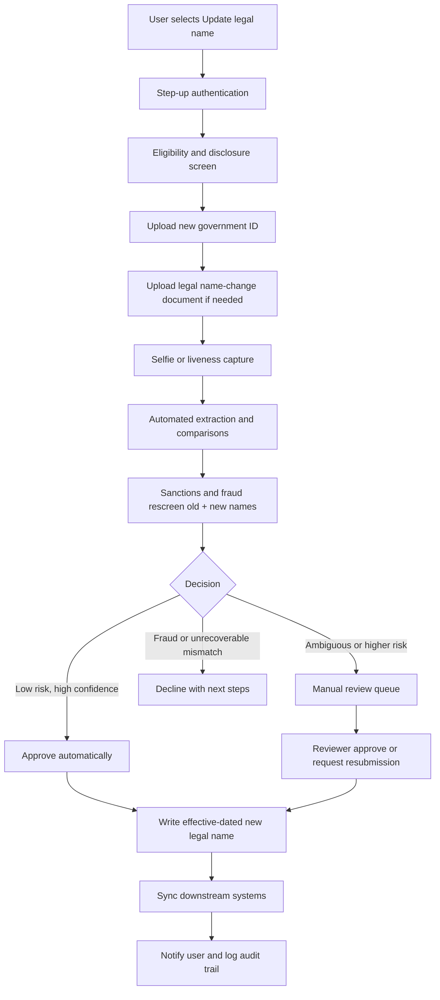
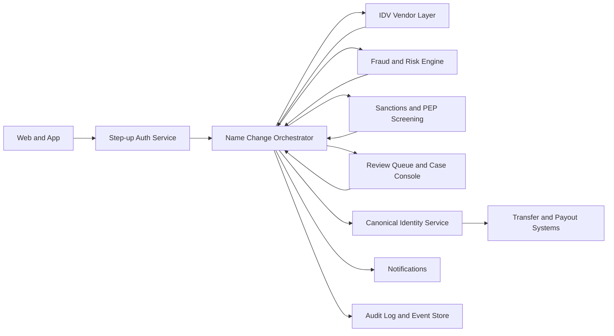

# Remitly Name Change Reverification Orchestrator

## Executive summary

A legal-name change in money movement is not just a profile preference. For a U.S. remittance provider like Remitly, the “name” on file sits inside regulated identity verification, anti-money-laundering controls, payment-instrument ownership checks, sanctions screening, downstream payout matching, and audit retention. Remitly’s U.S. user agreement says it may require identifying information such as name, address, date of birth, SSN, or government ID; that it must verify identity and record identifying information; that it may make inquiries with third parties and request additional information; and that it may refuse or limit transactions when needed to protect the parties or comply with legal and regulatory requirements. Remitly’s China flow also requires the sender to enter their name exactly as it appears on valid ID, and requires the recipient’s name and address to match the recipient’s ID, which makes names operational transaction data rather than mere UI labels. citeturn26view0turn27view1turn28view0

The design opportunity is therefore **not** “add an edit button to profile.” It is to create a **case-based reverification and orchestration product** that lets legitimate customers self-serve most legal-name changes, while routing ambiguous or risky cases to human review with full auditability. The opportunity is real because the market already shows multiple compliant patterns: Coinbase, PayPal, and Revolut support largely digital self-serve legal-name change flows; Wise uses support-mediated document review; BECU requires a structured form and human verification; and Citi separates a preferred/chosen name from the regulated legal name on the account. That variation strongly suggests the friction is **not purely mandated by law**. It is the product of risk appetite, legacy systems, vendor maturity, and operational design choices. citeturn16search0turn18search1turn18search11turn18search3turn16search1turn19search0

## Design brief

### Problem statement

Today, there is no publicly documented Remitly self-serve legal-name-change flow in the materials reviewed. The public profile URL redirects to login, and Remitly’s current public help surfaces emphasize Help Center, chat, and phone support; Remitly also announced a redesigned Help Center with transparent contact options and an AI-powered support assistant. That pattern is consistent with a support-centric recovery path rather than a clearly exposed, self-serve legal-name-change journey. citeturn1view0turn2search10turn2search11turn2search9

The product problem is: **How might Remitly let legitimate customers update a legal name quickly and safely, without increasing fraud, sanctions exposure, payout failures, or compliance risk?** The right framing is an **identity-change event**, not a profile-edit event. This matters because FinCEN guidance for customer identification makes clear that information collected at account opening must be retained, and that updated information serves a different purpose; in other words, the right solution is not to simply overwrite the old name. citeturn9search7turn27view1

### User personas

| Persona | Core need | Special considerations |
|---|---|---|
| Recent legal name changer | Update account quickly after marriage, divorce, court order, or gender-affirming name change | Needs low-friction digital upload of new ID + legal name-change evidence; may still have older tax, bank, or payment records during transition. Supported by SSA and IRS workflows that require name/SSN consistency over time, not instant ecosystem-wide propagation. citeturn10search0turn10search1turn9search2 |
| Shared-household or joint-account-adjacent user | Wants household financial tools to respect their name change across linked instruments | In broader banking this can involve joint holders or authorized users. For Remitly specifically, the account is single-user only, so the nearest analogue is a household using shared funding sources or cards while the Remitly account remains individually owned. citeturn26view0 |
| Identity-theft victim | Needs an urgent, protected route that does not force standard automation to decide alone | FTC guidance recommends recovery workflows, fraud alerts, and freezes; this persona should bypass normal low-risk automation and route to specialist review. citeturn15search0turn15search1turn15search2 |
| International remitter with transliterated or non-Latin names | Needs name matching across Latin and native-script systems without payout failure | Remitly’s China guidance requires exact ID matching for recipient details; OFAC lists include aliases and approximate matching is used in screening. Vendor extraction models can also capture native-script names. citeturn28view0turn14search0turn14search6turn21search0 |

### Goals and success metrics

| Dimension | Goal | Suggested pilot metric |
|---|---|---|
| UX | Reduce support dependency for straightforward legal-name changes | Completion rate; median time to first decision; customer effort score |
| Security | Prevent account takeover and mule/sanctions evasion through “name change” | Confirmed fraud rate; sanctions/PEP rescreen completion; false-negative review sampling |
| Compliance | Preserve an auditable trail of prior and current identifying information | 100% case audit trail completeness; immutable pre-change record retained |
| Operations | Reduce manual-review cost without sacrificing quality | Manual-review rate; queue aging; average handling time; repeat submission rate |
| Customer trust | Make status, evidence needs, and timelines legible | Contact rate per case; complaint rate; CSAT for completed cases |

### Constraints and assumptions

| Constraint area | What the design should assume | Sources |
|---|---|---|
| Regulatory | Remitly is a U.S. money transmitter/MSB; risk-based AML controls and customer-identification procedures apply, and transaction processing may be limited when required by law or risk controls. citeturn11search1turn13search0turn26view0 | FinCEN, Remitly |
| Tax and identity alignment | In the U.S., name/SSN mismatches can create downstream issues; SSA is the primary system of record for SSN name changes, and IRS guidance instructs taxpayers to ensure tax returns match Social Security records. citeturn10search0turn10search1turn9search2 | SSA, IRS |
| Cross-border rules | Exact sender/recipient name matching may be corridor-specific; Remitly’s China flow requires exact ID match for recipients and may require extra documentation if identity cannot be verified or amount/risk warrants it. citeturn28view0 | Remitly |
| EU/EEA and UK directionality | Remote onboarding and reverification are permitted but must be risk-sensitive, with stronger controls for non-face-to-face cases, governance, testing, and recordkeeping. citeturn23search0turn24search0turn24search3 | EBA, GOV.UK |
| Technical | Expect legacy data models, multiple downstream consumers of “name,” and third-party IDV/webhook integrations with duplicate or out-of-order delivery. citeturn20search0turn20search2turn21search1turn21search9 | Veriff, Persona |
| Operational | Not every case will auto-resolve; reviewer capacity and escalation playbooks are core product dependencies, not back-office afterthoughts. FCA’s recent review found that firms often have policies but weak practical guidance for frontline handling of CDD edge cases. citeturn24search1 | FCA |

## Compliance and risk foundation

### Why the process is hard

The hard part is not proving that a new ID is real. The hard part is proving that **the same regulated customer relationship** should continue under a new legal name without breaking controls that depend on historical identity, record retention, and cross-system matching. FinCEN’s customer-identification guidance distinguishes between information collected at account opening and later updates, requiring retention of the original opening information; OFAC sanctions screening also relies on aliases and approximate matching; and IRS/SSA alignment introduces external timing dependencies. In practice, this means a proper name-change product needs **effective-dated identity history, alias screening, and downstream reconciliation**, not just OCR plus “save.” citeturn9search7turn14search0turn14search6turn10search0turn9search2

At the same time, digital self-service is clearly feasible. The EBA’s remote onboarding guidelines are expressly technology-neutral and set standards for safe remote onboarding rather than requiring branch-only handling; UK AML guidance similarly requires CDD and enhanced diligence where appropriate, including when customers are not physically present or when existing-customer circumstances change. The market evidence aligns with that: Coinbase, PayPal, and Revolut have digital legal-name-change flows, while Wise and BECU use more support-led or form-based processes. The conclusion is that regulation sets the floor, but product design determines the experience. citeturn23search0turn24search0turn16search0turn18search1turn18search11turn18search3turn16search1

### Likely regulatory and document map

| Jurisdiction or regime | Likely implication for product | Typical evidence to support change | Sources |
|---|---|---|---|
| U.S. sender identity | Re-verify identity, preserve original identifying record, keep audit trail, and align legal name with government records over time | Updated government photo ID; legal name-change evidence such as marriage certificate, divorce decree, court order; possibly prior ID or SSN card for matching edge cases | citeturn27view1turn10search0turn10search8turn9search2turn16search0turn16search1turn18search3turn18search1 |
| U.S. sanctions and fraud controls | Re-screen under new and prior names; do not drop previous aliases from monitoring | New legal name + previous legal name(s) retained as aliases | citeturn14search0turn14search6turn15search1 |
| EU/EEA | Remote reverification may be done digitally if governance, assurance, vendor oversight, and risk controls are adequate | Government ID; potentially proof of address or additional evidence depending on risk | citeturn23search0 |
| UK | Apply CDD when circumstances change; stronger diligence for non-face-to-face cases; keep records five years | Name, photo ID, address/DOB evidence where needed; enhanced review if riskier or non-standard | citeturn24search0turn24search3 |
| China corridor or other payout-country specifics | Payout success depends on exact ID matching and corridor rules; sender or recipient details may need corridor-specific validation | Recipient name exactly as on ID; address as on ID; additional documentation if amount or verification status requires it | citeturn28view0 |

### Risk matrix

| Risk | Example failure mode | Primary controls |
|---|---|---|
| Account takeover disguised as name change | Attacker gains access, uploads forged “name change” docs, then sends funds under a different identity | Step-up auth before starting; selfie/liveness; compare new ID to historical device/account signals; hold high-risk transfers during pending review |
| Mule or sanctions evasion | Customer tries to replace legal name to weaken screening or obscure prior activity | Retain previous names as aliases; rescreen old + new names against sanctions/watchlists; require reviewer sign-off for high-risk hits |
| False positives from transliteration or partial mismatch | Legitimate customer with native-script/non-Latin name is auto-declined | Store native and Latin forms when available; support manual review and “known good alias” outcomes |
| Privacy breach | Sensitive ID documents overexposed internally or retained too long | Role-based access, redaction/deletion tooling, minimized field exposure, signed webhook handling |
| Vendor failure or duplicate events | IDV vendor sends duplicate or out-of-order decisions, causing inconsistent state | Idempotent handlers, event versioning, case status state machine, replay-safe webhooks |
| Customer harm from ambiguous status | Customer is frozen out with no explanation or ETA | Clear pending/review UI, estimated time windows, evidence checklist, chat escalation with case context |
| In-flight transfer corruption | Name update changes historical transfer records or breaks existing investigations | Keep immutable transaction snapshots; apply new legal name prospectively after approval |

The sanctions-screening risk is real because OFAC lists include aliases and the official search tool uses approximate string matching; the identity-theft risk is real because FTC guidance treats fraud alerts, freezes, and recovery workflows as standard consumer protections; and the integration risk is real because Veriff explicitly warns that webhooks may arrive out of order and recommends idempotency checks, while Persona exposes explicit approval, manual-review, and redaction controls. citeturn14search0turn14search6turn15search1turn20search0turn21search9turn21search10

## Recommended end-to-end product design

### Product principles

The core recommendation is to create a **Name Change Reverification Case**. The user is never directly editing the canonical legal name in-place. Instead, they are opening a regulated case that may end in approval, manual review, resubmission, or decline. This is the right abstraction because Remitly already treats identity verification as a legal and risk-controlled process, and because original identity records need to remain auditable rather than overwritten. citeturn27view1turn9search7

A second recommendation is to explicitly split **legal name** from **preferred name**. Citi and Wise already distinguish a preferred/chosen name from legal identity used for account records, verification, invoices, and certain transactions. For Remitly, that creates a pragmatic two-speed experience: a customer can immediately update the name used in greetings and support interactions, while the legal name enters a reverification case for regulated use. citeturn19search0turn18search3

### Scenario IA for the MVE prototype

The MVE should show six deterministic scenarios:

| ID | Scenario | Why it belongs in MVE |
|---|---|---|
| S1 | Complete legal-name update | Proves the remote happy path with ID, name-change proof, selfie match, approval, alias retention, downstream sync, and saved-card reminder |
| S2 | Missing name-change document | Proves the recovery path when photo ID exists but the document connecting old and new legal names is missing |
| S3 | Routine safety check finds a similar name | Proves specialist review without implying the customer is the person on a list |
| S4 | Account check fails before document collection | Proves the hard stop before collecting sensitive documents and gives the customer a support-review path |
| S5 | Preferred-name update only | Proves chosen display name can be changed without touching legal identity |
| S6 | Two written forms do not line up clearly | Proves transliteration/document-name review only when passport, ID, proof, and Latin spelling do not already resolve the case |

Small spelling corrections should not be a separate MVE scenario. They should enter through the same legal-name request, then be routed by policy after account and evidence checks. Otherwise the prototype implies that a user can bypass reverification by labeling the request as a typo.

### Recommended flow



### UX wireframe guidance

| Screen | What user sees | Design note |
|---|---|---|
| Entry point | “Update legal name” under Profile; secondary link for “Use a preferred name instead” | Makes legal vs preferred distinction explicit |
| Disclosure | Why this needs reverification, what documents are accepted, privacy summary, expected timelines | Turn compliance into understandable expectation-setting |
| Evidence capture | Guided upload with document examples and live validation | Avoid “submit and pray” |
| Review status | Case progress: submitted, in review, approved, needs action | Show reviewer/commentary only when safe |
| Outcome | Approved with effective date; or “needs one more document”; or protected decline | Clear recovery paths |

### Copy examples

**Entry point**

> Update your legal name
> Because Remitly is a regulated money transfer service, we need to re-verify your identity before changing the legal name on your account. citeturn27view1

**Disclosure**

> What you’ll need
> Usually this includes your updated government ID and, if your new ID does not fully explain the change, a legal document such as a marriage certificate, divorce decree, or court order. citeturn10search0turn16search0turn16search1turn18search3turn18search1

**Pending review**

> We’re reviewing your documents
> Most straightforward cases are reviewed automatically. More complex cases may need a specialist review. We’ll notify you when there’s an update.

**Resubmission**

> We couldn’t confirm the change yet
> Please upload a clearer image of your new ID, or add a legal name-change document that links your previous name to your current one.

**Preferred name fast lane**

> Use a preferred name in the app
> This changes how we address you in the app and support interactions. It does not change your legal name on your account or documents. citeturn19search0turn18search3

### Competitor comparison

| Provider | Publicly documented pattern | Design takeaway | Sources |
|---|---|---|---|
| Coinbase | Self-serve legal-name change in Profile with photo-ID verification; secure support upload if change is not processed | Strong precedent for digital-first legal-name update with fallback | citeturn16search0 |
| PayPal | Web self-serve name-change flow; may require supporting documentation and valid photo ID | Mature pattern for tiered self-serve + evidence upload | citeturn18search1 |
| Revolut | In-app name change with government ID; typically approved in minutes | Fast digital flow is feasible when confidence is high | citeturn18search11 |
| Wise | Many profile details editable, but legal name after transfers requires support plus legal doc + new ID | Regulated fallback path without branch dependency | citeturn18search3 |
| BECU | No online self-edit for name; structured form plus updated/current IDs and court or SSN evidence; DocuSign/video/branch options | Human review is compatible with digital intake if tooling is good | citeturn16search1 |
| Citi | Chosen/preferred first name can be updated separately; legal name on account remains legal identity | Preferred-name split is a powerful incremental design pattern | citeturn19search0 |
| Chase and Discover | Public guidance emphasizes legal docs and that issuers vary by online, phone, in-person, or branch processes | Variation is wide; law does not dictate a single UX | citeturn17search1turn33search0 |

## Data, systems, and implementation

### Architecture



A vendor-backed orchestration layer is preferable to embedding the logic directly in profile settings. Veriff’s workflow assumes a session model, webhook callbacks, HMAC signing, and explicit handling for out-of-order delivery and idempotency; Persona similarly centers the flow on inquiries, approval/manual-review transitions, redaction, and verification checks. Those primitives map naturally to a dedicated orchestration service instead of ad hoc page logic. citeturn20search0turn20search2turn21search1turn21search2turn21search9turn21search10

### Data model notes

| Entity | Key fields | Why it matters |
|---|---|---|
| `customer_identity` | `customer_id`, `current_legal_name`, `prior_legal_names[]`, `preferred_name`, `dob`, `country`, `verification_status` | Keeps regulated identity separate from display name |
| `name_change_case` | `case_id`, `customer_id`, `case_path`, `status`, `risk_tier`, `opened_at`, `resolved_at` | Makes the change a first-class workflow object without asking for a personal reason |
| `identity_evidence` | `document_type`, `issuing_country`, `name_extracted`, `native_name`, `expiry`, `file_ref` | Supports extraction, comparisons, and reviewer context |
| `idv_session` | `vendor`, `vendor_session_id`, `decision`, `decision_score`, `webhook_seq` | Needed for webhook-safe orchestration |
| `review_decision` | `reviewer_id`, `decision`, `comment`, `policy_basis` | Required for auditability and QA |
| `downstream_sync_state` | `system`, `status`, `last_attempt_at`, `error_code` | Prevents silent partial failures |
| `audit_event` | `event_id`, `case_id`, `actor`, `action`, `timestamp`, `payload_hash` | Core compliance evidence |

Two implementation requirements are especially important. First, **do not hard-overwrite the original name**. FinCEN’s guidance explicitly distinguishes initial identifying information from later updates, so the identity model should be effective-dated and alias-aware. Second, **do not mutate historical transactions**. Remitly’s agreement says transaction details may not be changeable once submitted and users are responsible for accurate transaction details; therefore, completed and in-flight transfer records should remain immutable snapshots while the account’s legal identity updates prospectively after approval. This second point is a design inference, but it is the safest interpretation of the obligations in the agreement. citeturn9search7turn26view0

### Integration notes

Use explicit APIs and events rather than direct table writes.

```text
POST   /name-change-cases
POST   /name-change-cases/{id}/documents
POST   /name-change-cases/{id}/start-idv
POST   /webhooks/idv
POST   /name-change-cases/{id}/review/approve
POST   /name-change-cases/{id}/review/request-more-info
POST   /name-change-cases/{id}/review/decline
GET    /name-change-cases/{id}
```

Implementation should include:

- **Idempotency** on create, resume, and decision endpoints. Persona exposes an `Idempotency-Key` header, and Veriff recommends idempotency checks because webhook delivery is at-least-once. citeturn21search9turn20search0
- **Webhook authenticity checks** with HMAC signature validation. Veriff documents this explicitly. citeturn20search0
- **Rollback and partial-apply handling**. If downstream sync to a notification or transfer subsystem fails, the case should remain in “approved_pending_sync” rather than pretending the update is complete. This is a design recommendation grounded in the vendor webhook behavior and Remitly’s right to limit transactions when necessary. citeturn20search0turn26view0
- **Redaction and privacy controls**. Persona provides inquiry redaction endpoints; use the same principle internally for document retention minimization and role-scoped access. citeturn21search10
- **Native-script support**. Persona’s ID extraction model includes native-name fields; store them alongside normalized Latin forms when available to reduce transliteration pain. citeturn21search0

## Delivery, testing, and AI handoff

### Milestone plan

| Window | Deliverables | Owner set | Acceptance criteria |
|---|---|---|---|
| First month | Policy matrix, service blueprint, IA for legal vs preferred name, low-fidelity prototype, event/data schema, reviewer decision tree | Product Design, Compliance, Fraud, Eng Lead | Cross-functional sign-off on states, documents, risk tiers, and copy |
| Second month | Click-through prototype, backend stubs, vendor sandbox integration, reviewer queue MVP, webhook logging, analytics plan | Product Design, Frontend, Backend, Vendor Ops | End-to-end sandbox demo works with approve/request-more-info/decline paths |
| Third month | Narrow pilot, likely U.S. sender legal-name change only; operating runbook; dashboards; usability and fraud-test results | Product, Fraud Ops, Compliance Ops, Eng | Pilot cases can be processed with full audit trail and no manual spreadsheet dependency |

### Prioritized roadmap and trade-offs

**Prioritize now**

- U.S. sender legal-name change only
- Individual accounts only
- Updated ID + legal name-change document + selfie/liveness
- Reviewer console and audit log
- Alias retention and sanctions rescreen
- Preferred-name feature for communications

**Delay**

- Recipient legal-name correction in the same workflow
- Country-of-residence changes
- Business accounts
- Deep document localization beyond top corridors
- Full automation for identity-theft victims
- Large-scale retroactive rescreen migration

The main trade-off is clear: a first pilot should optimize for **trustworthy orchestration**, not maximum automation. A smaller, auditable workflow will stand up better in interview discussion than an overclaimed “AI solves KYC” demo.

### Test plan

| Test type | What to test | Example cases |
|---|---|---|
| Usability | Can users understand legal vs preferred name and required evidence? | Marriage, divorce, court order, non-Latin name, unclear document photo |
| Accessibility | Can users complete upload and status steps with assistive tech and low vision? | Screen reader, zoom, high contrast, keyboard-only |
| Fraud simulation | Can the system catch ATO and forged docs? | New device + mismatched selfie; reused document; impossible timeline |
| Compliance QA | Are records preserved and reviewer rationales logged? | Original-name retention; alias rescreen; audit export |
| Integration resilience | Do duplicate or out-of-order webhooks corrupt state? | Replay 3 identical webhooks; delayed decline after approval |
| Customer-support readiness | Can support understand and escalate case state without asking the user to repeat everything? | Pending review, resubmission, vendor outage |

### AGENTS.md starter snippet

```md
# AGENTS.md

## Mission
Build a case-based legal name change reverification workflow for a regulated remittance product.

## Product truths
- Legal name is regulated identity data, not a simple profile field.
- Preserve original identifying information and prior legal names.
- Preferred name is separate from legal name.
- Never mutate historical transfer snapshots after submission.
- High-risk or ambiguous cases must route to manual review.

## Compliance invariants
- Keep immutable audit events for every state transition.
- Screen both prior and proposed legal names through sanctions/fraud controls.
- Do not auto-approve if device risk, selfie mismatch, document mismatch, or identity-theft flags are present.
- Use idempotent webhook handlers and signed webhook verification.

## Privacy rules
- Do not use real PII in development, prompts, screenshots, or tests.
- Redact documents by default in logs.
- Limit raw document access to reviewer roles.

## Done means
- Happy path works end to end
- Manual review path works end to end
- Duplicate webhooks do not create duplicate decisions
- Case timeline is exportable for audit
```

### Example prompts for AI agents

**UI generation**

```text
Using the attached DESIGN.md, generate a React web flow for:
1) Update legal name entry point
2) Disclosure and document checklist
3) ID upload + legal document upload + selfie capture placeholders
4) Case status page
5) Preferred name fast-lane screen

Constraints:
- Do not hardcode real PII
- Add accessibility labels
- Include empty, loading, error, and resubmission states
- Keep legal and preferred names separate in state
```

**Backend stubs**

```text
Generate TypeScript/Node backend stubs for a Name Change Orchestrator service.
Include:
- POST /name-change-cases
- POST /name-change-cases/{id}/documents
- POST /webhooks/idv
- POST /review/approve
- POST /review/request-more-info
- POST /review/decline
- Event log table
- Effective-dated legal name model
- Idempotency middleware
- Webhook signature verification placeholder
```

**Test cases**

```text
Create Playwright and API test cases for the name-change reverification flow.
Cover:
- happy-path auto-approval
- specialist-review path
- needs-more-documents path
- blocked account-check path with support review request
- duplicate webhook replay
- out-of-order webhook arrival
- document mismatch
- sanctions alias hit
- preferred name update without legal name change
```

## Open questions and limitations

This DESIGN.md is strongest on the U.S. regulatory and operational picture. EU/EEA, UK, and China coverage here is intentionally directional rather than country-by-country legal advice, because the exact Remitly legal entity, sending country, and payout-partner obligations can vary by corridor. citeturn23search0turn24search0turn28view0

A second limitation is visibility: the provided Remitly profile URL is not publicly accessible without authentication, and no public Remitly article clearly documents a self-serve legal-name-change flow. The recommendations above therefore treat the current gap as a likely support-centric pattern, but not as a confirmed description of every logged-in state in production. citeturn1view0turn2search10turn2search11

The foundational conclusion remains solid: this is **not** only an experience gap, and it is **not** only an AML rule. It is a layered identity, fraud, compliance, and systems-orchestration problem. But because peer institutions already support more digital patterns, it is also a legitimate design opportunity for Remitly—especially if the prototype frames the solution as a **reverification case system** with a **preferred-name escape hatch**, rather than a naive “editable name field.” citeturn16search0turn18search1turn18search11turn18search3turn16search1turn19search0turn27view1
